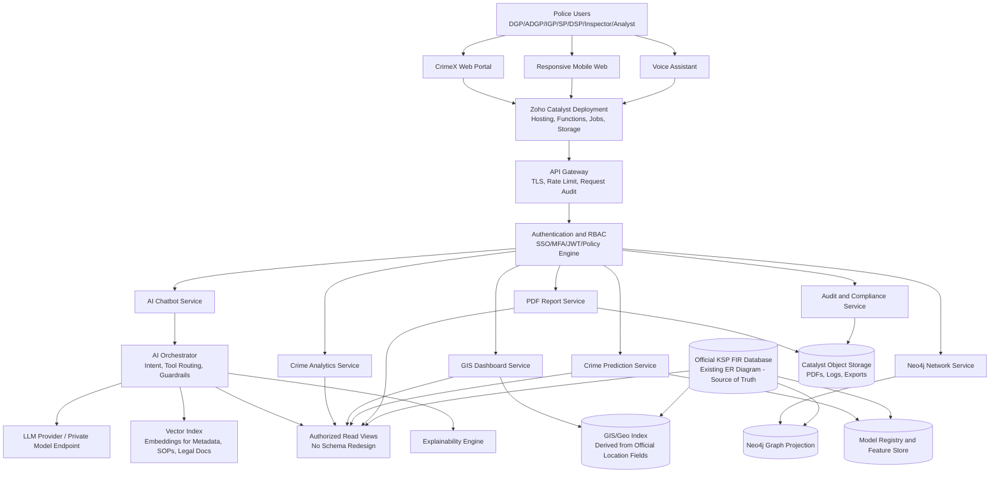
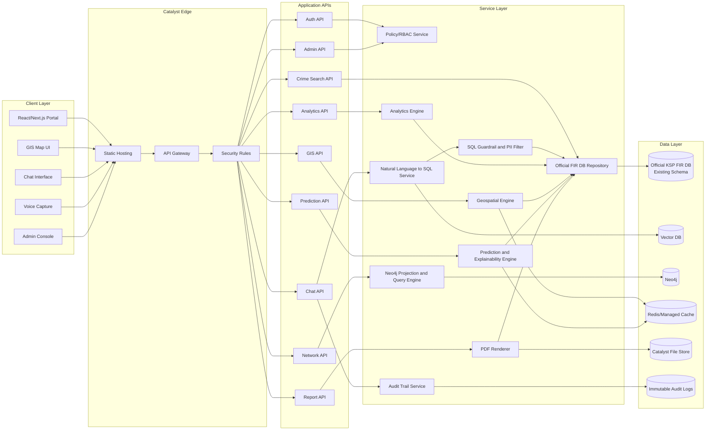
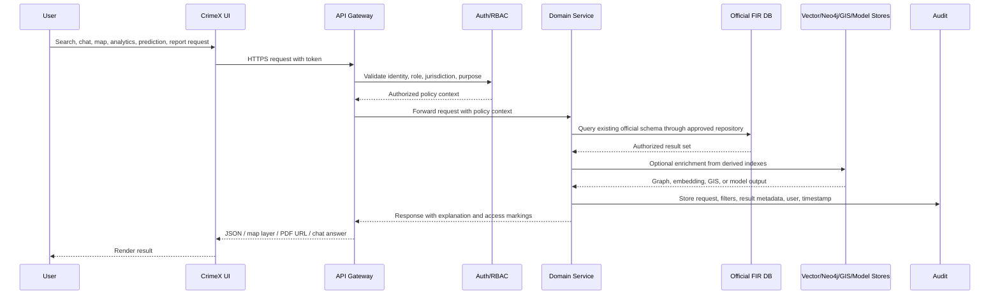
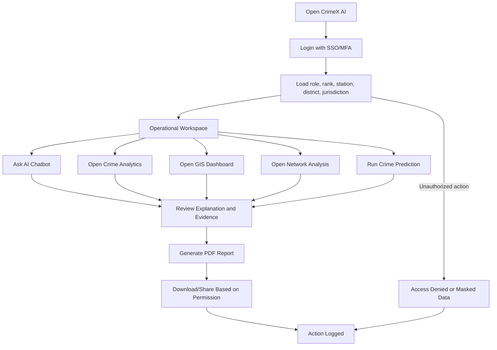
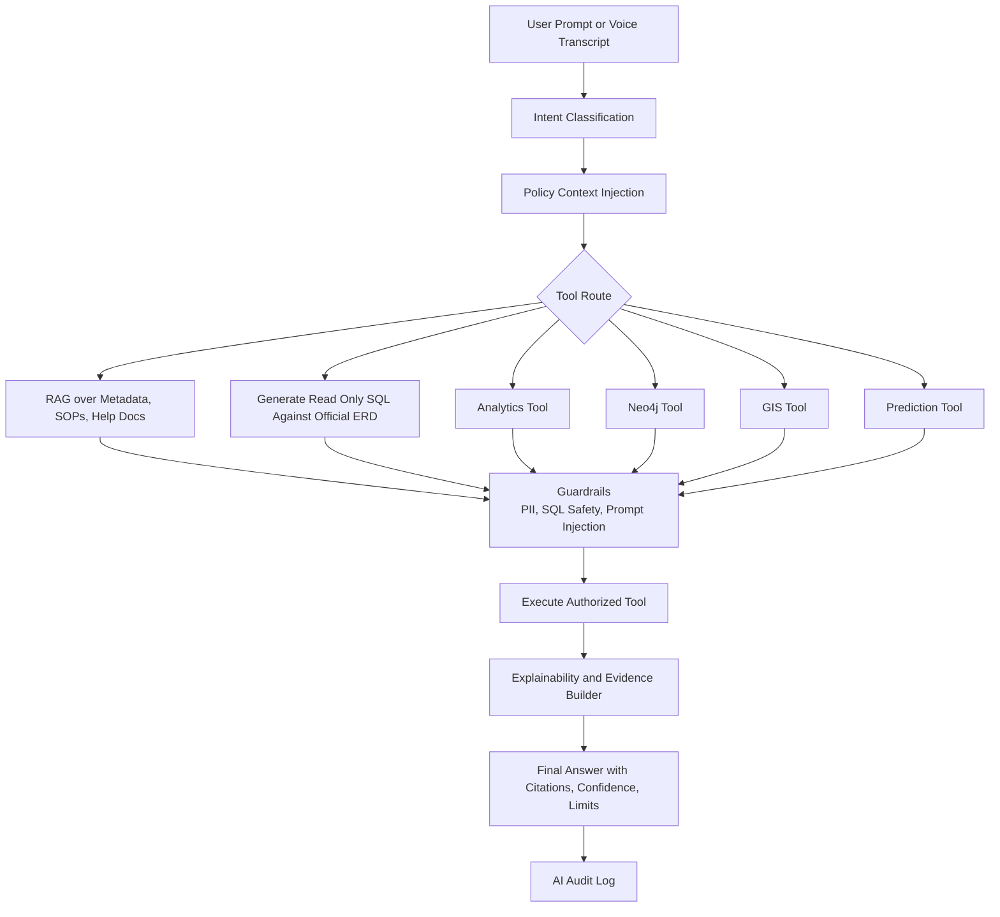
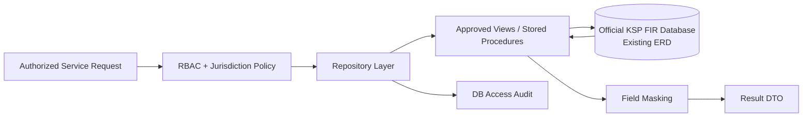
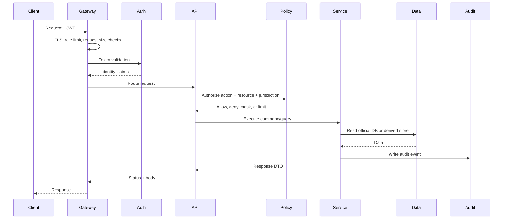
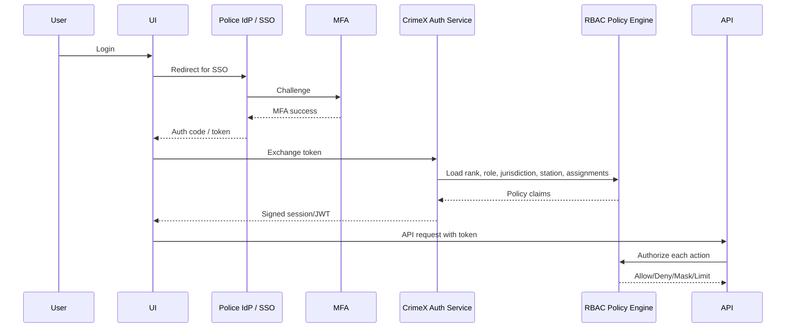
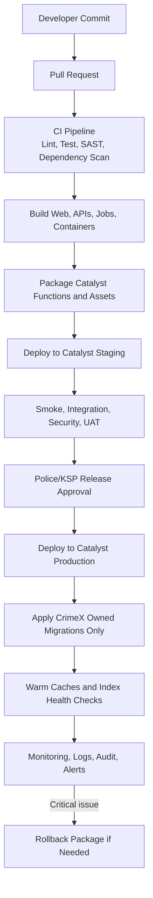

# CrimeX AI Architecture

Intelligent Conversational AI for the Karnataka State Police Crime Database.

## Architecture Principles

- Use the official KSP FIR Database ER Diagram exactly as provided.
- Do not create, rename, denormalize, or reinterpret official FIR tables.
- Keep all SQL access behind governed repository and view layers.
- Separate operational crime data, AI indexes, graph projections, GIS tiles, audit logs, and reporting artifacts.
- Enforce role based access at API, service, database, vector, graph, and report layers.
- Make every AI answer traceable to authorized source records, generated SQL, confidence, and explanation.
- Support deployment on Zoho Catalyst while allowing secure connectivity to the official KSP database.

## 1. System Architecture

CrimeX AI is a secure, modular platform composed of client applications, an API gateway, domain services, AI orchestration, analytics engines, and governed integrations with the official FIR database.

Core capabilities:

- AI chatbot for natural language crime database queries.
- Crime analytics dashboards for trend, hotspot, station, district, and category analysis.
- GIS dashboard for map based crime exploration.
- Neo4j network analysis for accused, complainant, location, vehicle, phone, modus operandi, and case relationship discovery.
- Crime prediction using approved historical features derived from the existing schema.
- Voice assistant for speech to text and text to speech interactions.
- Explainable AI for query reasoning, model explanations, and evidence references.
- Role based access for police hierarchy and investigation needs.
- PDF report generation with watermarking, audit metadata, and export controls.
- Catalyst deployment for web app, serverless APIs, scheduled jobs, object storage, and environment management.

## 2. High Level Diagram



## 3. Low Level Diagram



## 4. Data Flow



Data handling rules:

- Official FIR DB remains the system of record.
- Derived stores are rebuildable projections, not authoritative databases.
- AI generated SQL is read only by default.
- Any create/update workflow must call existing official database procedures or approved integration APIs.
- Sensitive fields are masked based on role, case assignment, jurisdiction, and legal restrictions.

## 5. User Flow



Primary user journeys:

- Investigator asks for case details, accused history, related FIRs, and location patterns.
- Superintendent reviews district crime trends, hotspot maps, station performance, and category patterns.
- Analyst builds periodic reports using filters, charts, maps, and network insights.
- Command officer reviews prediction outputs with explanations, confidence, and known limitations.
- Voice user dictates a natural language query and receives a spoken summary plus visual evidence.

## 6. AI Flow



AI safety controls:

- Retrieval only from approved metadata, official schema documentation, SOPs, and authorized records.
- SQL generation constrained to whitelisted tables, columns, joins, filters, limits, and read only operations.
- Prompt injection detection before tool execution.
- No direct LLM access to raw unrestricted database credentials.
- Answers include evidence pointers and avoid unsupported claims.
- Prediction outputs are advisory and must show confidence, feature drivers, and operational caveats.

## 7. Database Flow



Database integration design:

- Use the official FIR ERD as the only relational model.
- Maintain schema metadata in the application as documentation, not as a replacement schema.
- Add external read views only if approved by KSP DB governance and mapped directly to existing tables.
- Keep application migrations limited to CrimeX owned stores such as audit logs, model metadata, vector metadata, user preferences, and report metadata.
- Synchronize Neo4j, GIS indexes, and model features through scheduled read jobs from the official DB.
- Every query includes user identity, role, jurisdiction, purpose, and correlation ID.

## 8. API Flow



Representative APIs:

- `POST /api/chat/query`
- `POST /api/voice/transcribe`
- `GET /api/crimes/search`
- `GET /api/analytics/trends`
- `GET /api/gis/hotspots`
- `GET /api/network/entities/{id}`
- `POST /api/predictions/crime-risk`
- `POST /api/reports/pdf`
- `GET /api/audit/events`
- `POST /api/admin/roles`

API standards:

- JSON over HTTPS.
- JWT or Catalyst authenticated session token.
- Correlation ID on every request.
- Idempotency key for report generation and long running jobs.
- OpenAPI specification generated from source.
- Structured errors with user safe messages and internal diagnostic IDs.

## 9. Authentication Flow



RBAC model:

- Roles: super admin, command officer, district officer, station officer, investigator, analyst, report viewer, system auditor.
- Scopes: state, range, district, subdivision, station, assigned case, special unit.
- Permissions: search, view sensitive fields, export, generate report, run prediction, view network, administer users, audit access.
- Controls: MFA, session timeout, device/IP policy, emergency access workflow, approval for bulk export.

## 10. Deployment Flow



Deployment design:

- Catalyst Web Client Hosting for frontend.
- Catalyst Advanced I/O Functions for APIs.
- Catalyst Cron/Scheduled Functions for graph, GIS, vector, and feature refresh jobs.
- Catalyst Object Storage for generated PDFs and exports.
- Catalyst environment variables or secure vault for secrets.
- Private connectivity/VPN/allowlisted connection to the official FIR DB.
- Separate development, staging, UAT, and production environments.
- Blue/green or rolling deployment for API functions where supported.

## 11. Technology Stack

| Layer | Recommended Technology |
| --- | --- |
| Frontend | React or Next.js, TypeScript, Tailwind CSS, shadcn/ui where suitable |
| GIS UI | MapLibre GL JS or Leaflet, GeoJSON, vector tiles |
| API | Node.js/NestJS or Python/FastAPI on Catalyst Functions |
| AI Orchestration | LangGraph/LangChain or custom tool router with strict guardrails |
| LLM | Approved private LLM endpoint or government approved cloud model |
| Embeddings | Approved embedding model with vector index |
| Vector Store | pgvector, Qdrant, Milvus, or managed vector DB |
| Official Database | Existing KSP FIR database schema exactly as provided |
| Relational Access | Read only service account, approved views, stored procedures |
| Graph | Neo4j for derived network projections |
| Analytics | SQL aggregations, DuckDB/Polars for batch jobs, dashboard APIs |
| Prediction | Python, scikit-learn, XGBoost/LightGBM, MLflow-style registry |
| Explainability | SHAP/LIME for models, SQL/evidence trace for chatbot |
| Voice | Speech to text and text to speech service approved by department |
| Reports | HTML to PDF renderer, Puppeteer/Playwright or PDFKit |
| Cache | Redis or Catalyst compatible cache |
| Auth | Police SSO/IdP, MFA, JWT, policy engine |
| Audit | Immutable structured logs, SIEM integration |
| Deployment | Zoho Catalyst Hosting, Functions, Cron, Object Storage |
| Observability | OpenTelemetry, centralized logs, metrics, alerts |

## 12. Folder Structure

```text
crimex-ai/
  apps/
    web/
      src/
        app/
        components/
        features/
          chat/
          analytics/
          gis/
          network/
          prediction/
          reports/
          admin/
        lib/
        styles/
    mobile-web/
  services/
    api-gateway/
    auth-service/
    chat-service/
    crime-query-service/
    analytics-service/
    gis-service/
    network-service/
    prediction-service/
    report-service/
    audit-service/
  packages/
    official-schema-metadata/
      README.md
      erd-reference.md
      table-catalog.md
      query-contracts.md
    rbac/
    api-contracts/
    db-repositories/
    ai-guardrails/
    observability/
    shared-types/
  ai/
    prompts/
    tools/
    evaluation/
    rag-indexing/
    model-training/
    explainability/
  data-jobs/
    neo4j-projection/
    gis-index-refresh/
    vector-index-refresh/
    prediction-feature-refresh/
  infrastructure/
    catalyst/
      functions/
      cron/
      hosting/
      env/
    ci-cd/
    monitoring/
  docs/
    architecture/
    security/
    api/
    deployment/
    user-guides/
  tests/
    unit/
    integration/
    e2e/
    security/
    ai-evals/
```

Notes:

- `official-schema-metadata` stores documentation and query contracts derived from the provided ERD. It must not define a new schema.
- `db-repositories` contains code that maps service queries to the existing FIR database.
- Derived stores and job folders contain rebuildable projections only.

## 13. Development Roadmap

| Phase | Duration | Outcomes |
| --- | --- | --- |
| Phase 0: Discovery and Governance | 2 weeks | Confirm official ERD, roles, hosting constraints, data access process, security policy, audit needs |
| Phase 1: Foundation | 3 weeks | Catalyst setup, CI/CD, auth skeleton, API gateway, repository layer, audit logging |
| Phase 2: Core FIR Search | 4 weeks | Role aware crime search, filters, case details, masking, basic analytics |
| Phase 3: AI Chatbot MVP | 4 weeks | NL query, SQL guardrails, RAG over schema metadata/SOPs, explainable answers |
| Phase 4: GIS and Analytics | 4 weeks | Hotspot maps, district dashboards, time/category/station analytics |
| Phase 5: Neo4j Network Analysis | 4 weeks | Graph projection jobs, entity relationship explorer, path finding, centrality |
| Phase 6: Reports and Voice | 3 weeks | PDF reports, voice input/output, report templates, watermarking |
| Phase 7: Prediction and XAI | 5 weeks | Feature pipeline, model training, validation, SHAP explanations, model governance |
| Phase 8: Hardening and UAT | 4 weeks | Security testing, load testing, AI evals, user training, release readiness |
| Phase 9: Production Rollout | 2 weeks | Production deployment, monitoring, support runbooks, feedback loop |

## 14. Sprint Planning

Assumption: 2 week sprints.

| Sprint | Goal | Key Deliverables |
| --- | --- | --- |
| Sprint 1 | Project foundation | Repo setup, architecture baseline, Catalyst environments, CI pipeline |
| Sprint 2 | Security foundation | SSO integration stub, RBAC model, audit schema for CrimeX owned logs |
| Sprint 3 | Official DB integration | Read only connectivity, repository contracts, ERD metadata catalog |
| Sprint 4 | Crime search MVP | FIR search APIs, filters, masking, UI list/detail views |
| Sprint 5 | Analytics MVP | Aggregation APIs, trend charts, station/district summaries |
| Sprint 6 | Chatbot MVP | Intent routing, schema aware NL2SQL, answer formatting, SQL guardrails |
| Sprint 7 | AI reliability | Prompt injection checks, citations, evaluation set, fallback handling |
| Sprint 8 | GIS dashboard | Map layers, hotspot API, location filters, clustering |
| Sprint 9 | Neo4j projection | Entity extraction mapping, graph load job, relationship API |
| Sprint 10 | Network UI | Entity explorer, path search, graph visualization, explanations |
| Sprint 11 | PDF and exports | Report templates, PDF generation, watermarking, export permissions |
| Sprint 12 | Voice assistant | STT/TTS integration, voice query UI, spoken summaries |
| Sprint 13 | Prediction pipeline | Feature job, training notebook/service, baseline model |
| Sprint 14 | XAI and governance | SHAP explanations, model cards, approval workflow |
| Sprint 15 | Hardening | Load tests, security tests, audit review, observability dashboards |
| Sprint 16 | UAT and release | User training, production checklist, release, support handover |

Definition of done:

- Role based tests pass.
- Audit event generated for every sensitive action.
- No direct UI access to database.
- AI answer includes evidence or clearly says when evidence is unavailable.
- Query respects official schema and approved access contracts.
- Security and privacy review completed for production features.

## 15. Risk Analysis

| Risk | Impact | Likelihood | Mitigation |
| --- | --- | --- | --- |
| Official FIR schema misunderstood | Incorrect answers or broken joins | Medium | Use provided ERD as source of truth, validate query contracts with KSP DB team |
| AI generates unsafe SQL | Data leakage or DB impact | Medium | Read only DB user, SQL parser, allowlists, row limits, approval gates |
| Unauthorized access to sensitive records | Legal and operational risk | High | RBAC, jurisdiction checks, masking, audit logs, export controls |
| Prediction bias or misuse | Wrong operational decisions | Medium | XAI, model cards, validation, human in loop, advisory labeling |
| Poor location quality in FIR records | Bad GIS hotspots | Medium | Data quality scoring, geocoding review queue, confidence indicators |
| Neo4j projection drift | Inaccurate network analysis | Medium | Scheduled rebuilds, reconciliation checks, projection metadata |
| LLM hallucination | Loss of trust | Medium | Evidence-first responses, citations, confidence, refusal for unsupported claims |
| Voice transcription errors | Incorrect query execution | Medium | Confirmation step for sensitive queries, transcript display |
| Catalyst connectivity limits | Deployment delay | Medium | Early network proof of concept, allowlisting, fallback integration path |
| PDF export misuse | Sensitive data spread | High | Watermarks, download permissions, expiry links, audit, approval for bulk reports |
| Performance under heavy analytics | Slow dashboards | Medium | Caching, pre-aggregations where approved, pagination, async jobs |
| Data residency/compliance issue | Production blocker | Medium | Approved hosting, encryption, legal/security review, SIEM integration |

## Cross Cutting Security Controls

- TLS everywhere.
- Encryption at rest for CrimeX owned stores.
- Separate service accounts by function.
- Least privilege access to official database.
- Secrets stored in secure environment configuration.
- PII masking and redaction by policy.
- Immutable audit trail for login, search, view, export, AI query, prediction, and admin actions.
- SIEM integration for suspicious activity.
- Periodic access recertification.
- Data retention policies for logs, generated reports, and temporary exports.

## Official ERD Usage Contract

CrimeX AI must integrate with the KSP supplied FIR database ERD as follows:

1. Treat the official ERD as the canonical database model.
2. Build repository methods from approved query contracts.
3. Document each query against official table and column names once the ERD is available in the project.
4. Keep Neo4j, GIS, vector, and prediction stores as derived projections.
5. Never use derived stores as legal source of truth.
6. Review every new query with database governance before production release.

## Initial Milestone Deliverables

- Signed off architecture document.
- Official ERD catalog and query contract document.
- Role and jurisdiction matrix.
- Security and audit design.
- Catalyst deployment proof of concept.
- Read only FIR DB connectivity proof of concept.
- AI chatbot MVP evaluation dataset.
- GIS and Neo4j projection mapping document.
- Prediction model governance template.
